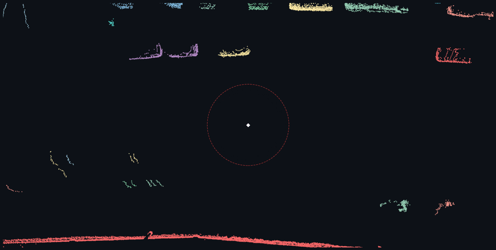

# pcrs



Rust library for 3D point cloud processing, with Python bindings via PyO3.

Designed around an SoA (Structure-of-Arrays) data model where coordinates live in
separate contiguous `Vec<f32>` arrays. This matches how LiDAR and depth sensors
actually produce data, avoids AoS padding overhead, and keeps the door open for
SIMD. All computation is f32 — sufficient for mm-scale accuracy and half the
memory bandwidth of f64.

The library is split into small, focused crates with a clear dependency graph:
`core` defines the `PointCloud` struct, `spatial` wraps a KD-tree, and everything
else (`filters`, `normals`, `registration`, `segmentation`, `io`) depends only on
what it needs. The Python package exposes the full API as `pointclouds_rs`.

## Performance

Measured on Apple M4 Max, release build. These are real outputs from the included
demo scripts, not synthetic microbenchmarks:

**KITTI obstacle detection** — 122K real Velodyne LiDAR points through voxel
downsample, statistical outlier removal, RANSAC ground plane, and Euclidean
clustering: p50 latency 89.5 ms across 100 frames, ~96 clusters per frame.

**Aerial LiDAR** — 241K points through voxel downsample, normal estimation,
RANSAC ground extraction, and clustering: 87 ms total (~2.8M pts/sec throughput).

SOR dominates at ~84 ms (per-point KNN is expensive). Everything else — voxel
downsample, RANSAC, clustering — totals under 9 ms. Clustering uses grid spatial
hashing + union-find.
Full Criterion microbenchmark data is in [BENCHMARKS.md](BENCHMARKS.md).

## Usage

### Python

```bash
pip install pointclouds-rs
```

```python
import numpy as np
import pointclouds_rs as pcr

# NumPy in, PointCloud out (f64 arrays are coerced to f32 automatically)
cloud = pcr.PointCloud.from_numpy(np.random.rand(100_000, 3).astype(np.float32))

# Downsample, filter, fit a ground plane, then cluster the obstacles
ds = pcr.voxel_downsample(cloud, voxel_size=0.05)
clean = pcr.statistical_outlier_removal(ds, k=10, std_multiplier=1.0)
plane = pcr.ransac_plane(clean, distance_threshold=0.02, iterations=1000)
obstacles = clean.select_inverse(plane.inliers)
clusters = pcr.euclidean_cluster(obstacles, distance_threshold=0.5,
                                 min_size=10, max_size=25000)

for i, c in enumerate(clusters):
    print(f"Cluster {i}: {len(c)} points")
```

### Rust

```bash
cargo add pointclouds-core pointclouds-filters pointclouds-segmentation
```

```rust
use pointclouds_core::PointCloud;
use pointclouds_filters::voxel_downsample;
use pointclouds_segmentation::{ransac_plane, euclidean_cluster};

let cloud = PointCloud::from_xyz(x_vec, y_vec, z_vec);
let ds = voxel_downsample(&cloud, 0.5);
let (plane, inliers) = ransac_plane(&ds, 0.02, 1000);
let obstacles = ds.select_inverse(&inliers);
let clusters = euclidean_cluster(&obstacles, 0.5, 10, 25000);
```

## What's included

**Filters**: voxel downsample, passthrough (axis range), statistical outlier removal,
radius outlier removal.

**Normals**: PCA-based estimation (rayon-parallel, analytical 3x3 eigensolver via
Cardano's formula). Viewpoint-oriented.

**Registration**: point-to-point ICP, point-to-plane ICP, rigid transform
composition and application.

**Segmentation**: RANSAC plane fitting (with deterministic seeded variant),
Euclidean clustering via grid spatial hashing + union-find with rayon-parallel
pair generation.

**I/O**: PCD (ASCII + binary), PLY (ASCII + binary), LAS read. All formats
preserve normals and colors where applicable.

**Spatial**: KD-tree (kiddo v5) with KNN and radius search.

## Building from source

```bash
# Run tests
cargo test --workspace

# Build Python wheel (release mode)
pip install maturin
maturin develop --release --manifest-path crates/python/Cargo.toml
pytest tests/test_python.py

# Run the demo pipelines (no data files needed, they generate synthetic scenes)
python examples/python/kitti_obstacle_detection.py
python examples/python/aerial_lidar.py --quick
```

## Current limits

- SOR is the bottleneck in most pipelines (O(n * k * log n) from per-point KNN).
  A grid-based approach would help but isn't implemented yet.
- ICP doesn't scale past ~10K points without subsampling — correspondence search
  is O(n log n) per iteration.
- No explicit SIMD intrinsics yet. The SoA layout is ready for it but the compiler
  is doing the vectorization for now.
- Clustering pair generation can blow up with very small radius relative to point
  density (cells get dense, O(n * k) pairs where k is cell occupancy).

## License

MIT or Apache-2.0, at your option.
